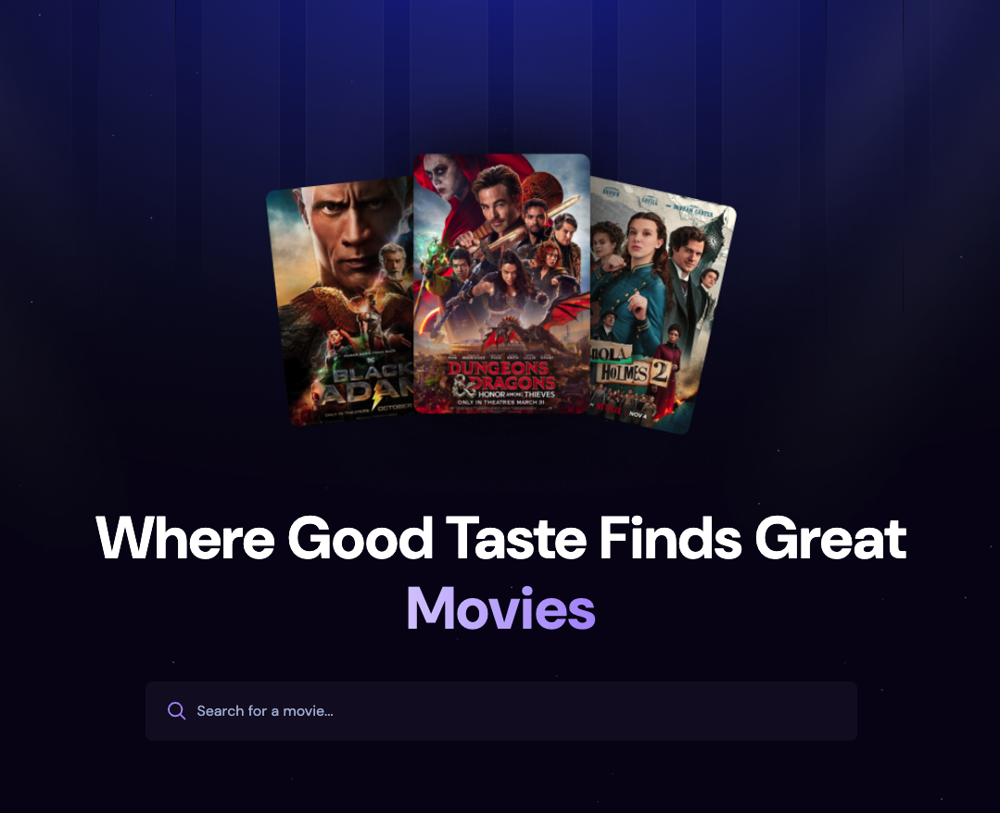
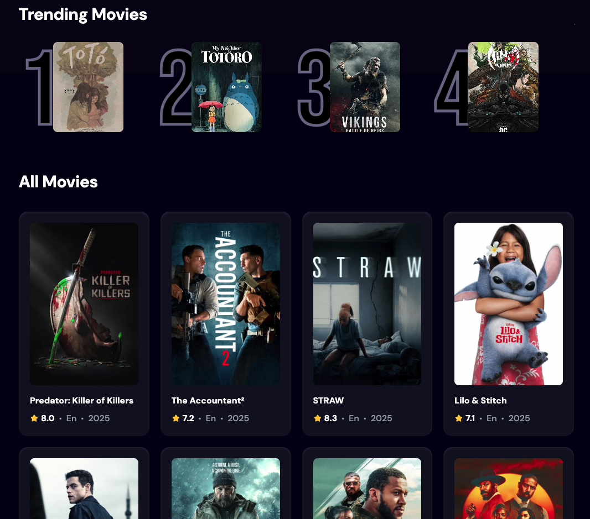

# 🍿 Popcorn & Chill



**Popcorn & Chill** is a single-page movie app built with modern web technologies. It’s designed to explore and search movies with a clean UI and efficient performance.

---

## ✨ Tech Stack

- 🔍 **Movie Search & Discovery** using the [TMDB API](https://www.themoviedb.org/)
- ⚛️ **SPA** built with **React** and **Vite** for fast load times
- 🎨 **Tailwind CSS** for a modern, responsive UI/UX
- 🧠 **React Hooks** for managing component state and side effects
- ☁️ **Appwrite** (BaaS) used as a **headless CMS** for backend features like storing user search history

---

## 📸 Screenshots




---

## Why I Built This

This project was created for my portfolio to demonstrate:

- My understanding of **React app architecture** and component-based design
- Using **hooks like `useEffect` and `useState`** to manage data fetching and state
- Integrating with a **third-party API (TMDB)** for real-world data
- Experimenting with **Appwrite**, a new backend tool I wanted to try as a BaaS and CMS-like solution
- Applying responsive styling and accessibility practices with **TailwindCSS**

---

## 🚀 Getting Started

1. Copy .env.example and complete it with your keys.
2. Install Dependencies:

```bash
npm install
```

3. Run the App

```bash
npm run dev
```
